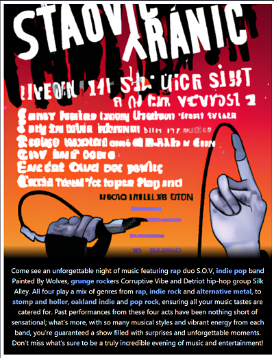
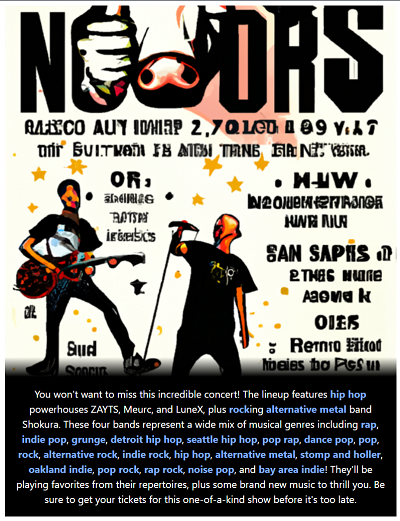

# Spot Me
This repo is the UI for the Spot Me app, which is a minimal app showcasing the
Spotify API and Open AI API. In short, Spot Me generates a concert flier
based on the genres of music associated with tracks you have saved
in your spotify account.

See examples below.

To use the app you'll have to be added to my Spotify app allowlist. You can
send me an email (austin.w.milt@gmail.com) with your first and last names, and the email you use
to sign in to Spotify. Or, visit the site and it will give you a mailto link to
use.

https://sage-duckanoo-bca3f3.netlify.app/

## Developing
[TBD]
